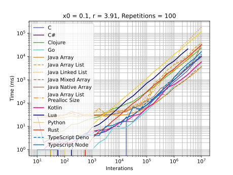

# logistic-benchmark
My goal here is compare how different languages behave while creating a sequence for [Logist Map](https://en.wikipedia.org/wiki/Logistic_map).

# Basic implementation
The code below comes from [Typescript implementation](languages/typescript-logistic-benchmark/src/index.ts), but all implementation follow the same schema:
```typescript

export interface ProcessResult {
  readonly series: number[];
  readonly time: number;
}

export function calculate(x0: number, k: number, size: number): ProcessResult {
  const series = new Array<number>(size);

  const t0 = Date.now();
  series[0] = x0;
  for (let i = 1; i < size; i++) {
    series[i] = k * series[i - 1] * (1.0 - series[i - 1]);
  }
  const time = Date.now() - t0;

  return { series, time };
}

function simpleAction(x0: number, r: number, interactions: number, showSeries: boolean): void {
  const result = calculate(x0, r, interactions);

  if (showSeries) {
    console.log("-".repeat(40))
    result.series.forEach((x) => console.log(x));
    console.log("-".repeat(40))
  }

  console.log("TIME:", result.time, "ms");
}

function repeatAction(x0: number, r: number, interactions: number, repetitions: number): void {
  const times = new Array<number>(repetitions);

  const t0 = Date.now();
  for (let i = 0; i < repetitions; i++) {
    process.stdout.write(`\r${i + 1}\t/\t${repetitions}`);
    times[i] = calculate(x0, r, interactions).time;
  }
  const time = Date.now() - t0;
  process.stdout.write("\n");

  const average = times.reduce((a, b) => a + b, 0) / repetitions;

  console.log("AVERAGE", average, "ms");
  console.log("TOTAL_TIME " + time)
}

/************************************
 * MAIN
 ************************************/

const action = process.argv[2];
const x0 = parseFloat(process.argv[3]);
const r =  parseFloat(process.argv[4]);
const iter = parseInt(process.argv[5]);

if(action === "s") {
  const showSeries = (process.argv.length === 7) && (process.argv[6] === "s");
  simpleAction(x0, r, iter, showSeries);
} else if(action === "r") {
  const repetitions = parseInt(process.argv[6]);
  repeatAction(x0, r, iter, repetitions);
}
```
The core function is the `calculate` one, that receives the values of `x0` (initial value of series), `r` and `size` (the number of interactions and size of series). At end it returns a tuple (or equivalent) containing the created series and the time to created, in milliseconds.

In `simpleAction`, `calculate` is called and the series is printed to output (if `showSeries` is true) as well the time.

`repeatAction` will create the same series the number of times determinated by `repetitions` parameter. IT will be printed the average time for each repetition and the total time to all repetitions.

The main part receives the command line arguments to extract the parameters and execute the processing.

## Implementations
  - [C](languages/c-logistic-benchmark/)
  - [Clojure](languages/clojure-logistic-benchmark/)
  - [C#](languages/cs-logistic-beanchmark/)
  - [Go](languages/go-logistic-benchmark/)
  - Groovy (Pending)
  - [Java](languages/java-logistic-benchmark/)
  - [Kotlin](languages/kotlin-logistic-benchmark/)
  - [Kotlin Native](languages/kotlin_native_logistic_benchmark/)
  - [Lua](languages/lua-logistic-benchmark/)
  - [Python](languages/python-logistic-benchmark/)
  - [Ruby](languages/ruby-logistic-benchmark/)
  - [Rust](languages/rust-logistic-benchmark/)
  - [Scala](languages/scala-logistic-benchmark/)
  - [TypeScript](languages/typescript-logistic-benchmark/)

## Graphics
### All Languages


### All Languages, until 100,000

### All Languages, until 10,000

