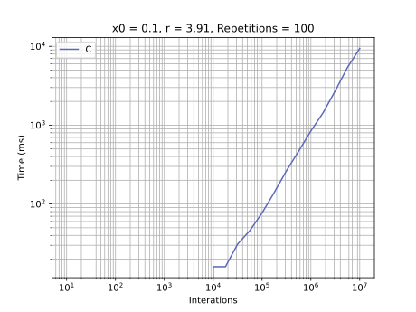
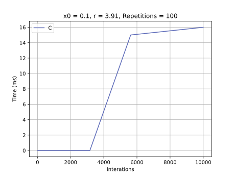

# C Language

## Development Environment
  - g++ (GCC) 11.2.0

## Highlights
To create the array I had to use `malloc` function from `stdlib.h`. When we create a array in C such as `double[] series = double[size];` this size must be a constant, not coming from a variable (such as `int size = 1000;`). Therefore I had to appeal to `malloc` to create a `double` pointer with requested size.

Its execution time is one of fastest, mainly when series size is lesser than 10,000. However when the series size is 10,000,000, although its time is 10 seconds, I observed that my machine runs out of memory enough. My Spotfy sound crackles during these 10 seconds.

## Graphics
### General execution

### Detail for less than 10,000 executions
