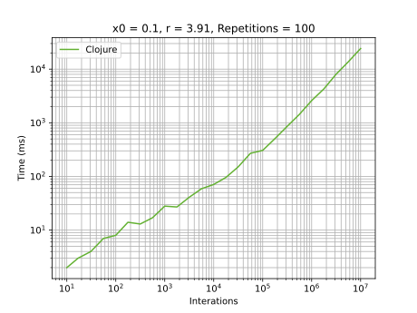

# Clojure

## Development Environment
  - Clojure 1.10.3
  - IntelliJ 2021.3.2 with [Cursive 1.12](https://cursive-ide.com/)

## Highlights
I used [`double-array`](https://clojuredocs.org/clojure.core/double-array) with preallocated size.

## Graphics
### General execution

