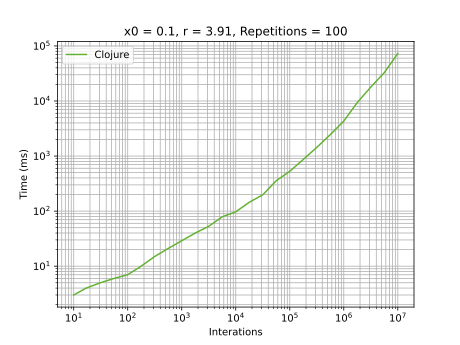

# Clojure

## Development Environment
  - Clojure 1.10.3
  - IntelliJ 2021.3.2

## Highlights
Since I have no experience clojure, I had to use a lot of trial and error. Initially I tried use [`double-array`](https://clojuredocs.org/clojure.core/double-array), but it did not work (I need remember why) . So I used [`vector`](https://clojuredocs.org/clojure.core/vector).

Its execution time is one of slowest. probably because as the vector size grew it had to spend some time to allocate a larger size. 

## Graphics
### General execution

