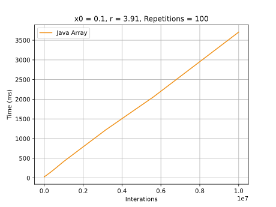
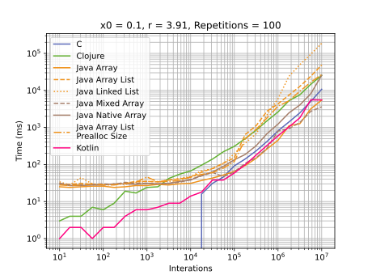
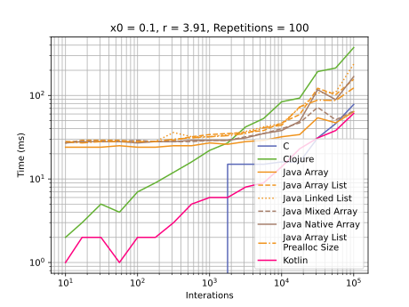

# Java

## Development Environment
  - Java 17
  - IntelliJ 2021.3.2
  - For Native DLL:
    - C++ 20
    - Visual Studio Community 2022

## Highlights

### [Java Double Array](./src/main/java/rafael/logistic_benchmark/benchmarks/JavaDoubleArrayGenerator.java )
Create a double array with size equals to number of interactions
#### Graphics

### [Java Native Array](./src/main/java/rafael/logistic_benchmark/benchmarks/NativeDoubleArrayGenerator.java )
Calls a Native DLL to create a double array with size equals to number of interactions
#### Graphics

### [Java Mixed Array](./src/main/java/rafael/logistic_benchmark/benchmarks/MixedDoubleArrayGenerator.java )
Calls the Native DLL until 50,000 interactions and uses JAva Double array after this.
#### Graphics

### [Array List](./src/main/java/rafael/logistic_benchmark/benchmarks/ArrayListBenchmark.java)
Uses a new [ArrayList](https://docs.oracle.com/en/java/javase/17/docs/api/java.base/java/util/ArrayList.html#%3Cinit%3E())
without initial size.
#### Graphics

### [Array List with prealloced size](./src/main/java/rafael/logistic_benchmark/benchmarks/ArrayListBenchmark.java)
Uses a new [ArrayList](https://docs.oracle.com/en/java/javase/17/docs/api/java.base/java/util/ArrayList.html#%3Cinit%3E())
without initial size.
#### Graphics

### [Java Linked List](./src/main/java/rafael/logistic_benchmark/benchmarks/LinkedListBenchmark.java )
 Create a new [Linked List](https://docs.oracle.com/en/java/javase/17/docs/api/java.base/java/util/LinkedList.html) 
 with initial size 0. It was the slowest execution among Java implementations. 
#### Graphics

## Graphics
### General execution

### Until 100,000 interactions

### Until 10,000 interactions

