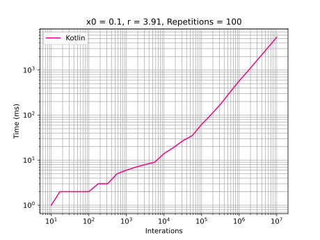
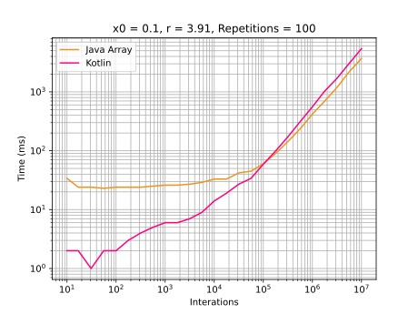

# Kotlin

## Development Environment
  - Kotlin 1.6.10
  - Java 17
  - IntelliJ 2021.3.2

## Highlights
It was used a `DoubleArray`. Compared with Java Double array, Kotlin is faster 
until 100,000 interactions. After this, Java is faster.

## Graphics
### General execution

### Comparison with Java

