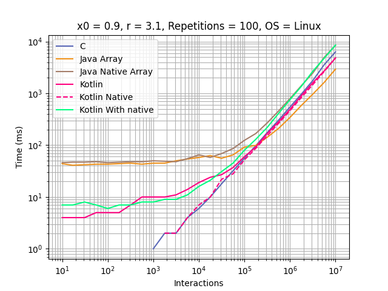
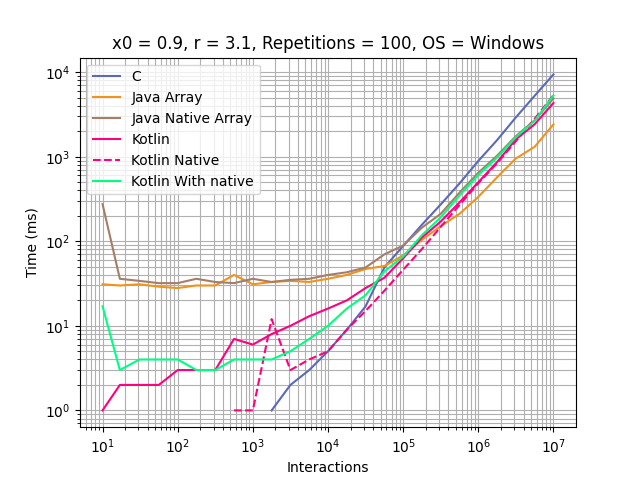

# Kotlin With Native

## Development Environment
  - Kotlin 1.7.20
  - Java 17
  - IntelliJ 2021.3.2
  - Visual Studio 2022 (For Windows)
  - GCC 10.2 (For Linux)

## Highlights
Kotlin running in JVM calling native code for series generation via JNI. 
Until approximately 20,000 interactions is it faster than Kotlin JVM 
and until 5,000,000 it is faster than java native.

## Graphics
### General execution

