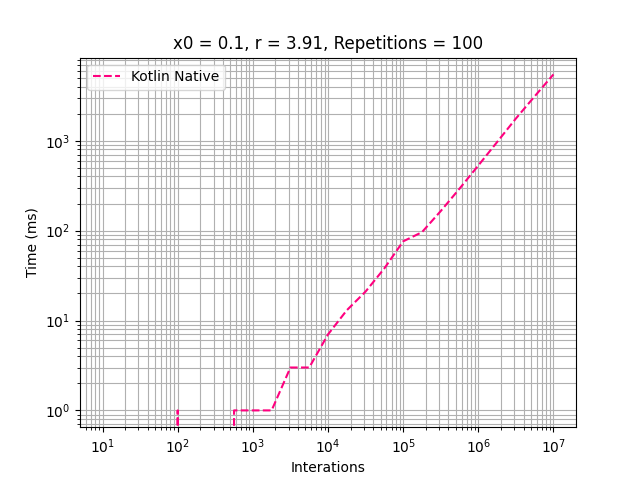
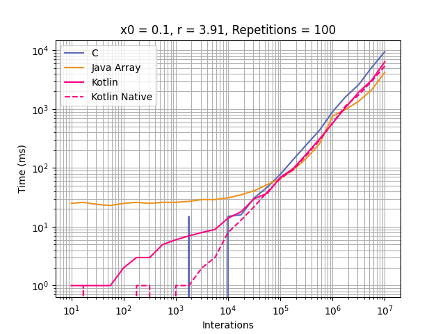
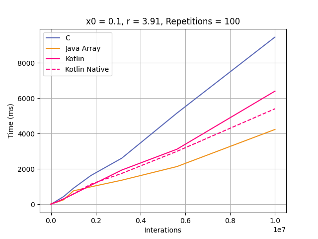
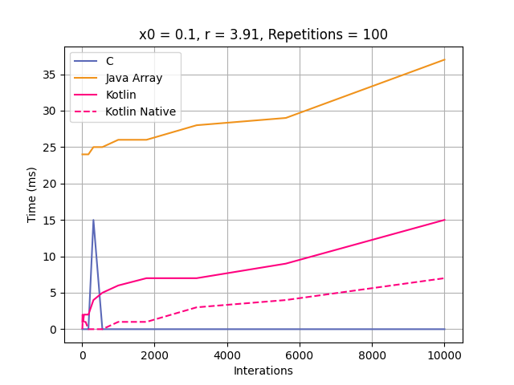

# Kotlin Native

## Development Environment
  - Kotlin 1.6.10
  - Kotlin Multiplatform 1.6.10
  - Java 17
  - IntelliJ 2021.3.2

## Highlights
After configure the project, I just copied the code from [Kotlin Project](../kotlin-logistic-benchmark/README.md).

Compared with Kotlin JVM, it is faster until approximately 50,000 interactions. 
After this the times become similar. 

## Graphics
### General execution

### Comparison with C, Java and Kotlin JVM

