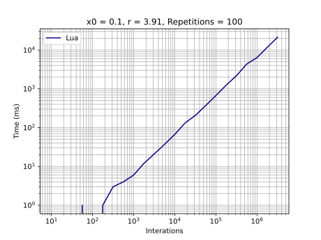

# Lua

## Development Environment
  - Lua 5.1.5
  - VS Code

## Highlights
I had to use an [empty table](https://www.lua.org/pil/2.5.html). It is not possible, or easy, create a table with predetermined size.

Also I had to limit interactions until 5,000,000, because after this value Lua crashes with message `not enough memory`.

## Graphics
### General execution

