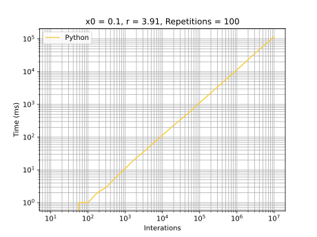

# Python

## Development Environment
  - Python 3.10.1
  - VS Code

## Highlights
It was possible to use a list with predetermined size. However at the end it was the slowest to execute.

## Graphics
### General execution

