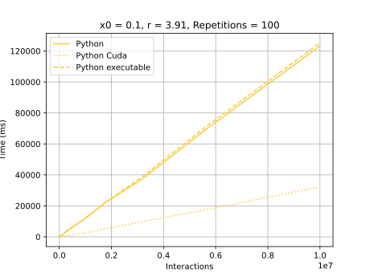
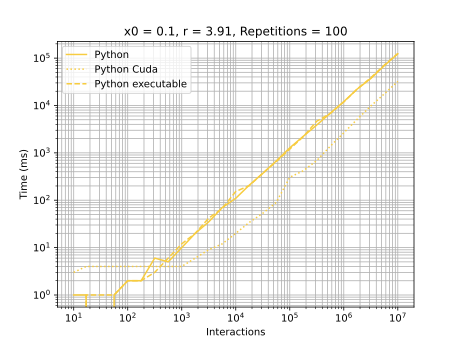

# Python

## Development Environment
  - Python 3.10.1
  - VS Code

## Highlights

### [Basic script](./main.py)
It was possible to use a list with predetermined size. However at the end it was the slowest to execute.

### [Native Executable](./setup.py)
Creates a native executable from Basic Script. The time as practically the same as basic script.

### [Cuda integration](./main_cuda.py)
Basically equals to Basic Script, but using [numba decorators](https://numba.pydata.org/numba-doc/latest/user/jit.html). Until interactions 500 interactions its time is greater than basic script. After this the execution time was basically 1/3 than basic script.

## Graphics
### General execution

