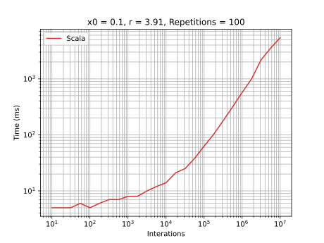
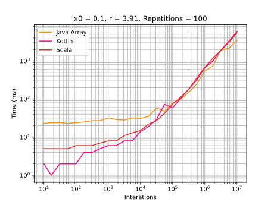

# Scala

## Development Environment
  - Scala 2.13.8
  - Java 17
  - IntelliJ 2021.3.2

## Highlights
It was used an [`Array`](https://www.scala-lang.org/api/current/scala/Array.html) of 
[`Double`](https://www.scala-lang.org/api/current/scala/Double.html). Compared with Java Double array, Scala is faster 
until 100,000 interactions. After this, Java is faster. 
Curiously, after 10,000 interactions the times for Kotlin and Scala are very near. 

## Graphics
### General execution

### Comparison with Java and Kotlin

