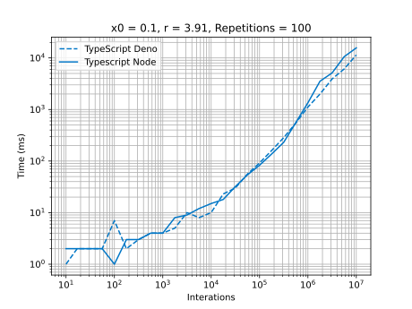

# TypeScript

## Development Environment
  - Typescript 4.5.5
  - Node 16.13
  - Deno 1.19.1
  - VS Code

## Highlights
I create one script for each platform and a common one. At end for small interactions the time for both Node and Deno are similar. But for greater interactions (> 100,000) Deno became faster.

## Graphics
### General execution

